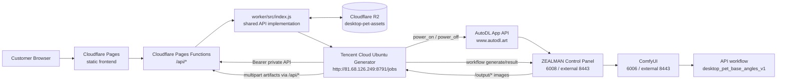
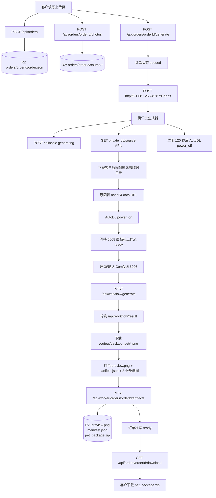
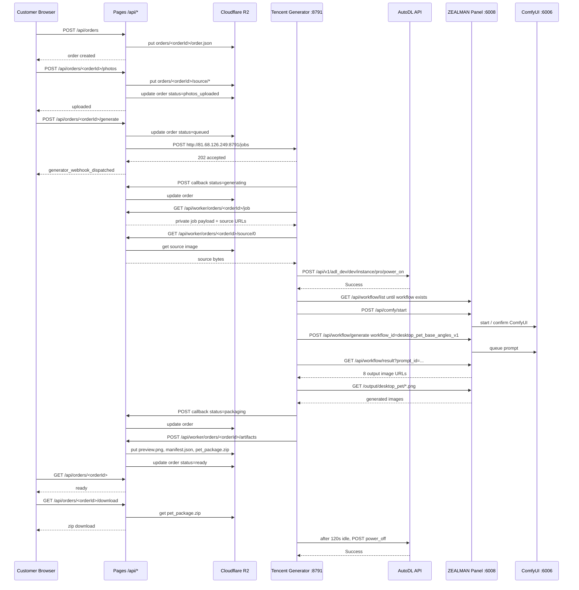

# 当前桌宠生产交付链路

## 结论

当前已经跑通的生产链路以 Cloudflare Pages 域名为主入口：

```text
https://desktop-pet-studio-exu.pages.dev
```

客户页面和 `/api/*` 都由 Pages 承载。`/api/*` 通过 Pages Functions 复用 `worker/src/index.js` 里的 Worker API 代码，订单和产物落到 Cloudflare R2，生成任务投递到腾讯云生成器。腾讯云生成器负责按需开关 AutoDL 应用实例，调用 ZEALMAN Control Panel 注册好的 ComfyUI 工作流，下载输出图，打包后回传 R2。

`workers.dev` 入口仍可作为历史/备用 Worker 部署存在，但因为腾讯云和本机访问 `*.workers.dev` 曾出现超时，当前生产主链路不依赖它。

## 当前真实跑通架构



当前各层职责：

- Cloudflare Pages：展示首页、上传页、订单状态页和下载入口。
- Cloudflare Pages Functions `/api/*`：当前生产 API 入口，复用 `worker/src/index.js`。
- Worker API 代码：创建订单、接收图片、写入 R2、投递生成任务、接收生成器回调和产物。
- Cloudflare R2：存 `order.json`、原始宠物照片、预览图、最终 `pet_package.zip`。
- 腾讯云生成器：常驻公网调度服务，监听 `8791`，接收 `/jobs`，拉取私有订单/原图，调 AutoDL/ComfyUI，打包并回传。
- AutoDL 应用实例：按需开机，当前实例 `pro-7817332b4012`，镜像 `zealman-ComfyUI v8.84`，GPU `RTX 5090 x1`。
- ZEALMAN Control Panel：外部访问端口为 `8443`，内部服务对应 `6008`，提供 `/api/workflow/*` 和 `/api/comfy/*`。
- ComfyUI：外部访问端口为 `8443`，内部服务对应 `6006`，生产不需要打开画布，只由 Control Panel 调用 API 工作流。

## 数据流图



R2 路径约定：

```text
orders/<orderId>/order.json
orders/<orderId>/source/<photoId>.<ext>
orders/<orderId>/preview.png
orders/<orderId>/package/manifest.json
orders/<orderId>/package/pet_package.zip
```

当前 `pet_package.zip` 已验证包含：

```text
manifest.json
preview.png
images/base_front_full_body_*.png
images/front_closeup_identity_*.png
images/right_45_full_body_*.png
images/right_side_full_body_*.png
images/sitting_front_full_body_*.png
images/lying_side_full_body_*.png
images/left_45_full_body_*.png
images/left_side_full_body_*.png
source/source-0.png
```

## 接口交互图



## 接口清单

公开客户接口全部走 Pages 域名：

```text
POST https://desktop-pet-studio-exu.pages.dev/api/orders
POST https://desktop-pet-studio-exu.pages.dev/api/orders/:orderId/photos
POST https://desktop-pet-studio-exu.pages.dev/api/orders/:orderId/generate
GET  https://desktop-pet-studio-exu.pages.dev/api/orders/:orderId
GET  https://desktop-pet-studio-exu.pages.dev/api/orders/:orderId/download
```

生成器私有接口使用 `GENERATOR_SHARED_SECRET` Bearer 鉴权：

```text
GET  /api/worker/orders/:orderId/job
GET  /api/worker/orders/:orderId/source/:index
POST /api/worker/orders/:orderId/callback
POST /api/worker/orders/:orderId/artifacts
```

腾讯云生成入口：

```text
GET  http://81.68.126.249:8791/health
POST http://81.68.126.249:8791/jobs
```

AutoDL / ZEALMAN / ComfyUI 接口：

```text
POST https://www.autodl.art/api/v1/adl_dev/dev/instance/pro/power_on
POST https://www.autodl.art/api/v1/adl_dev/dev/instance/pro/power_off
GET  https://uu1056908-7817332b4012.westd.seetacloud.com:8443/api/workflow/list
POST https://uu1056908-7817332b4012.westd.seetacloud.com:8443/api/comfy/start
GET  https://uu1056908-7817332b4012.westd.seetacloud.com:8443/api/comfy/status
POST https://uu1056908-7817332b4012.westd.seetacloud.com:8443/api/workflow/generate
GET  https://uu1056908-7817332b4012.westd.seetacloud.com:8443/api/workflow/result?prompt_id=...
GET  https://uu1056908-7817332b4012.westd.seetacloud.com:8443/output/desktop_pet/*.png
```

## 当前生产环境变量

Cloudflare Pages / Functions：

```text
NEXT_PUBLIC_PET_API_BASE=https://desktop-pet-studio-exu.pages.dev
GENERATOR_WEBHOOK_URL=http://81.68.126.249:8791/jobs
R2 bucket=desktop-pet-assets
```

腾讯云生成器 `/opt/desktop-pet-generator-py/.env`：

```text
PORT=8791
GENERATOR_MODE=autodl
AUTODL_API_BASE=https://www.autodl.art
AUTODL_PANEL_BASE=https://uu1056908-7817332b4012.westd.seetacloud.com:8443
AUTODL_WORKFLOW_ID=desktop_pet_base_angles_v1
AUTODL_INPUT_IMAGE_KEY=25:image
AUTODL_INSTANCE_UUID=pro-7817332b4012
AUTODL_POWER_MANAGEMENT=1
AUTODL_START_COMFY=1
AUTODL_IDLE_SHUTDOWN_SECONDS=120
```

不要把以下密钥写入文档或提交仓库：

```text
GENERATOR_SHARED_SECRET
AUTODL_TOKEN
```

## 已踩过的坑和规避规则

- `workers.dev` 在本机和腾讯云曾出现超时，生产主入口必须使用 Pages 域名 `desktop-pet-studio-exu.pages.dev`。
- Cloudflare 曾对 Python 默认请求返回 1010/403，生成器访问 Pages 私有回调必须带稳定 `User-Agent: DesktopPetGenerator/0.1`。
- AutoDL 不能直接访问 Pages 私有原图 URL，因为原图接口需要 Bearer 鉴权。生成器必须先从 Pages 下载原图，再把图片转成 base64 data URL 或上传给面板后传文件名。
- ComfyUI UI 工作流 JSON 不能直接导入 ZEALMAN API 列表，必须在 ComfyUI 里使用“导出 (API)”格式，再到 `6008` 的“API生成”导入。
- `prompt_id` 只在 ComfyUI 内存 history 中有效，实例或 ComfyUI 重启后会丢。生成器必须在 `pending=false` 后立刻下载结果并上传 R2，不能把 AutoDL URL 当长期交付链接。
- ZEALMAN `/api/workflow/result` 会同时返回正式 `/output/...` 和临时 `/api/comfy/view?...type=temp` 图片。生产包只收 `raw.type=output` 或 `/output/` 的正式产物。
- 冷启动时 6008 面板可访问不代表 workflow 已可提交。生成器要等 `/api/workflow/list` 里出现 `desktop_pet_base_angles_v1`，并且 `POST /api/workflow/generate` 对 5xx 做重试。
- AutoDL 只做生成，不做下载站。客户下载必须来自 Pages/R2，这样 AutoDL 关机后仍可售后重下。
- 当前生产策略是“有订单再开机，空闲 120 秒关机”，宁可下一单多等冷启动，也避免 GPU 长时间空转计费。
