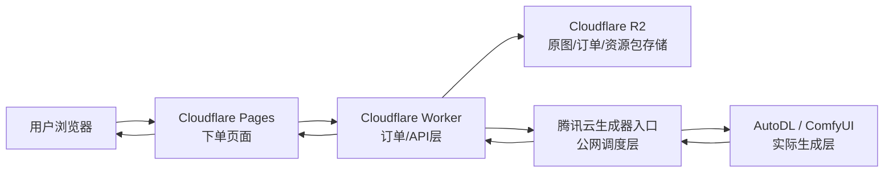
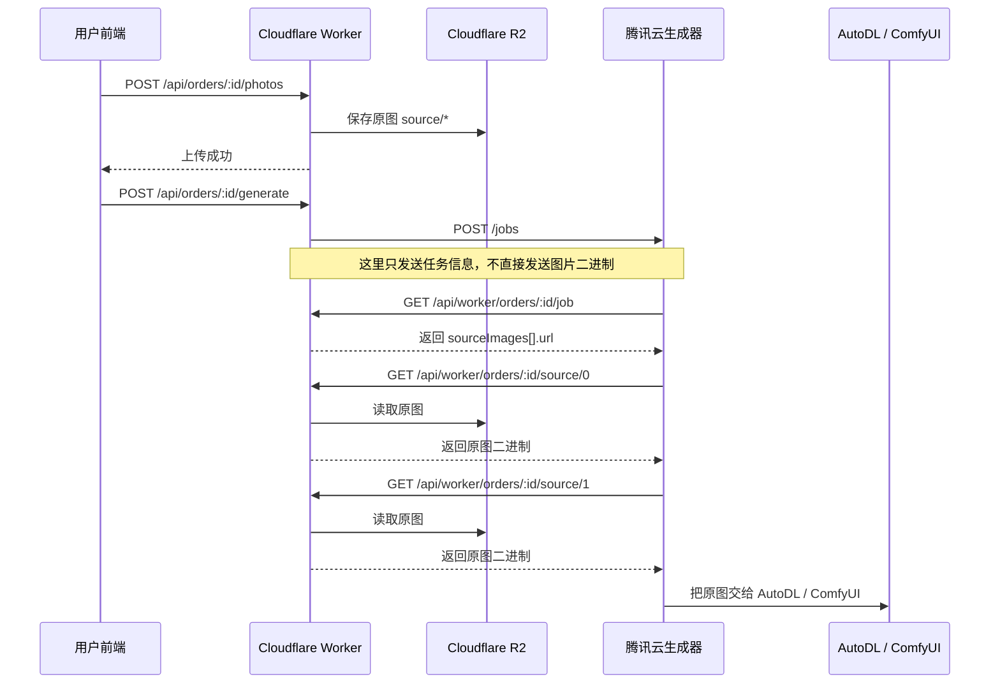
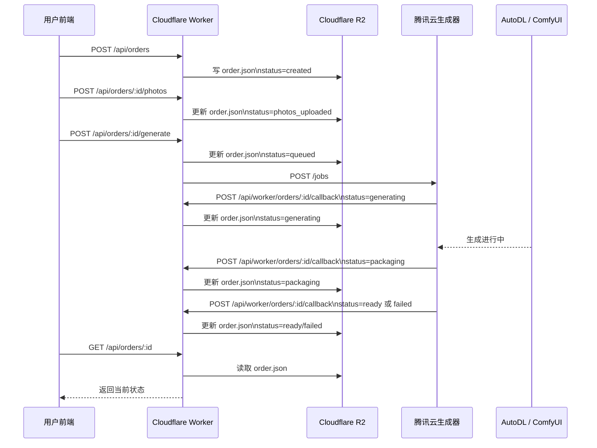
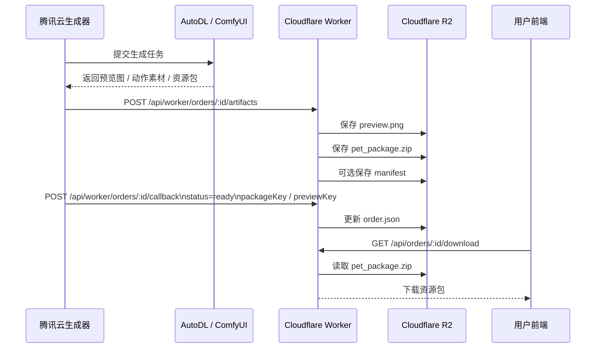

# Desktop Cat Studio 架构总览

本文档用于说明当前桌宠项目的整体架构、数据流向、核心接口以及当前联调状态。

## 1. 一句话概览

- Cloudflare Pages 负责前端下单页面。
- Cloudflare Worker 负责订单 API、状态管理和生成链路编排。
- Cloudflare R2 负责保存原图、订单信息、预览图和最终资源包。
- 腾讯云生成器负责接收 Worker 下发的生成任务，并调度 AutoDL / ComfyUI。
- AutoDL / ComfyUI 负责实际生成桌宠素材和资源包。

## 2. 当前整体架构图



## 3. 角色职责

### Cloudflare Pages

- 承载用户前端页面。
- 提交订单、上传原图、触发生成。
- 轮询订单状态。
- 提供资源包下载入口。

### Cloudflare Worker

- 创建订单。
- 接收并保存用户上传的图片。
- 维护订单状态机。
- 向腾讯云生成器发起 webhook。
- 提供生成器读取任务、下载原图、回传状态、回传成品的接口。

### Cloudflare R2

- 保存原始宠物图片。
- 保存 `order.json`。
- 保存预览图。
- 保存最终 `pet_package.zip`。

### 腾讯云生成器

- 对外暴露生成任务入口。
- 从 Worker 拉取订单详情。
- 从 Worker 拉取原图。
- 调用 AutoDL / ComfyUI。
- 把生成结果回传给 Worker。

### AutoDL / ComfyUI

- 负责实际图像生成。
- 负责动作素材生成。
- 负责打包桌宠资源。

## 4. 核心设计原则

### 原图只以 R2 为权威存储

- 用户上传后，原图正式保存在 Cloudflare R2。
- 腾讯云不是原图的长期存储层。
- 腾讯云一定会经过原图数据流，因为它要把原图交给 AutoDL。
- 腾讯云是否会把原图临时落到本机磁盘，取决于生成器实现，不取决于 Worker 协议。

### 腾讯云是调度层，不是最终存储层

- 腾讯云负责接任务、拉原图、调 AutoDL、回传结果。
- 最终资源包仍然回写到 Cloudflare R2。

## 5. 原图流泳道图

这条泳道描述“用户上传的原图如何到 AutoDL”。



## 6. 状态流泳道图

这条泳道描述“订单状态如何变化”。



## 7. 成品包流泳道图

这条泳道描述“生成后的预览图和资源包如何回传并下载”。



## 8. 核心接口总表

### 面向前端的接口

| 方法 | 路径 | 作用 |
| --- | --- | --- |
| `POST` | `/api/orders` | 创建订单 |
| `POST` | `/api/orders/:orderId/photos` | 上传宠物原图 |
| `POST` | `/api/orders/:orderId/generate` | 触发生成 |
| `GET` | `/api/orders/:orderId` | 查询订单状态 |
| `GET` | `/api/orders/:orderId/download` | 下载最终资源包 |

### 面向生成器的接口

| 方法 | 路径 | 作用 |
| --- | --- | --- |
| `GET` | `/api/worker/orders/:orderId/job` | 拉取订单详情、原图地址、回调地址 |
| `GET` | `/api/worker/orders/:orderId/source/:index` | 下载指定原图 |
| `POST` | `/api/worker/orders/:orderId/artifacts` | 回传预览图、zip 包、manifest |
| `POST` | `/api/worker/orders/:orderId/callback` | 更新状态为 generating/packaging/ready/failed |

### 生成器入口

| 方法 | 路径 | 作用 |
| --- | --- | --- |
| `POST` | `GENERATOR_WEBHOOK_URL` | Worker 向腾讯云生成器发起任务投递 |

## 9. 端到端简化流程

```text
用户下单
-> Pages 调 Worker 创建订单
-> 用户上传原图到 Worker
-> Worker 存 R2
-> 用户点击生成
-> Worker 调腾讯云生成器
-> 腾讯云生成器向 Worker 拉取订单详情与原图
-> 腾讯云生成器把原图交给 AutoDL / ComfyUI
-> AutoDL 生成素材与资源包
-> 腾讯云生成器把结果回传 Worker
-> Worker 存回 R2
-> 前端轮询状态
-> 用户下载资源包
```

## 10. 当前联调状态

截至当前这轮联调，已经确认：

- 前端下单页可正常访问。
- `POST /api/orders` 正常。
- `POST /api/orders/:orderId/photos` 正常。
- R2 存储逻辑正常。
- 生成器鉴权问题已定位并处理过。
- 当前主要卡点在 Worker 向腾讯云生成器投递 webhook 这一跳的公网联通与协议兼容。

## 11. 当前已知风险点

### 风险 1：Worker -> 腾讯云 webhook 仍未完全打通

- 前端 create/upload 已通。
- generate 这一步当前仍可能失败。
- 这属于“调度层联通问题”，不是前端上传问题。

### 风险 2：腾讯云是否临时落盘原图取决于生成器实现

- 架构层面不要求腾讯云长期保存原图。
- 但如果生成器脚本为了兼容 AutoDL/ComfyUI，需要把原图先下载到本地临时目录，这仍然可能发生。

## 12. 推荐的最终稳定形态

- Cloudflare Pages 继续作为前端页面。
- Cloudflare Worker 继续作为 API 编排层。
- Cloudflare R2 继续作为唯一正式对象存储。
- 腾讯云继续作为公网调度层。
- AutoDL 继续作为生成执行层。
- 腾讯云生成器入口建议收敛为标准域名 + 标准端口的稳定服务入口，降低 Worker 外呼不稳定因素。

